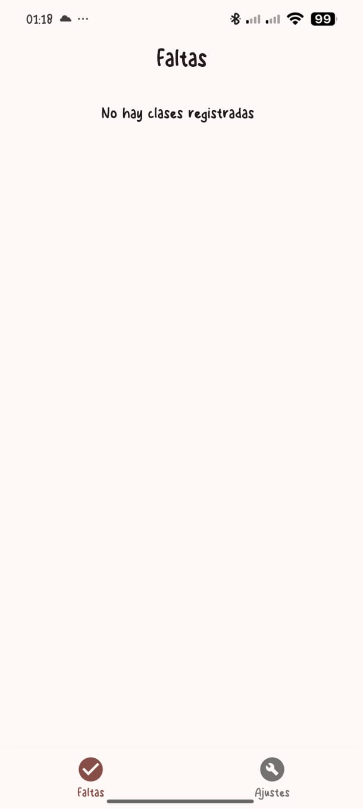
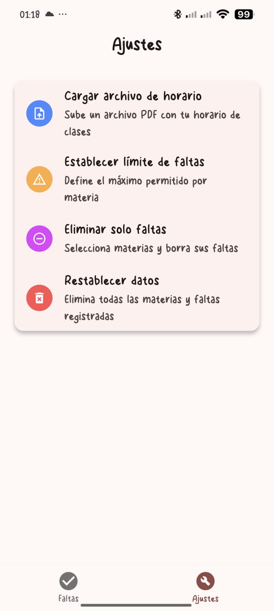
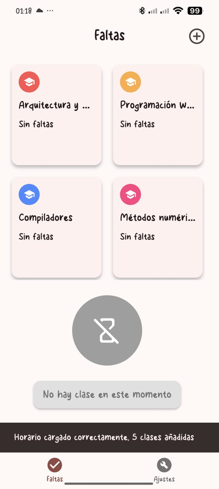
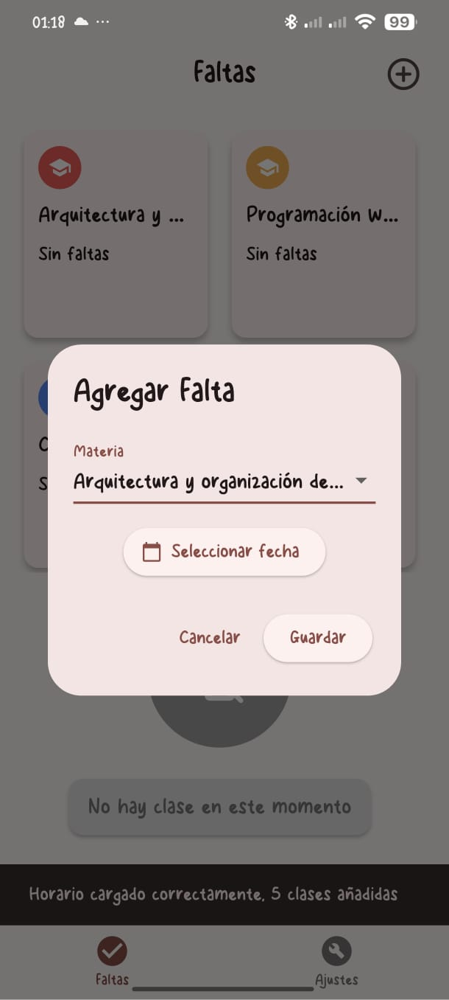
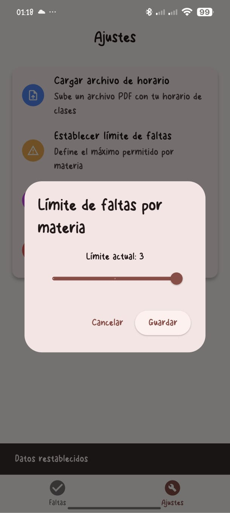

# FaltApp
FaltApp es una app para registrar y controlar faltas por materia. Detecta la clase en curso, activa un botón para registrar faltas y muestra alertas si estás cerca de una sanción académica.

---

### Pantalla principal por default

---

### Pantalla de ajustes

---

### Pantalla home con el horario ya importado

---

### Formulario para registrar una falta manualmente

---

### Ajustes para el limite de faltas
